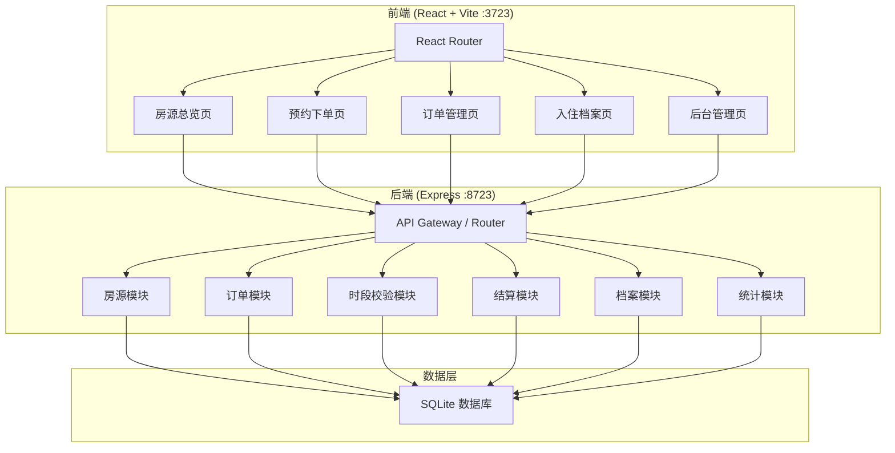
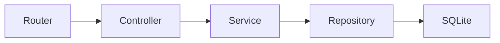
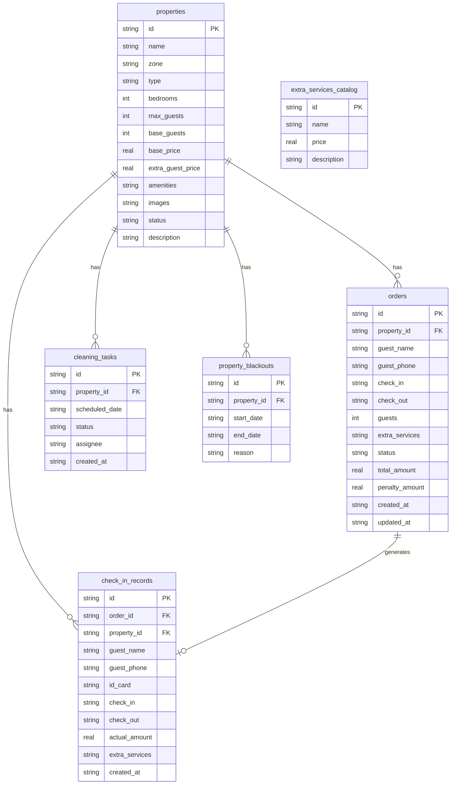

## 1. 架构设计



## 2. 技术说明
- 前端：React@18 + TypeScript + TailwindCSS@3 + Vite + Zustand
- 初始化工具：vite-init
- 后端：Express@4 + TypeScript（ESM 格式）
- 数据库：SQLite（better-sqlite3）
- 端口：前端 3723，后端 8723

## 3. 路由定义
| 路由 | 用途 |
|------|------|
| / | 房源总览页，分区展示房源 + 日历可订视图 |
| /booking/:propertyId | 预约下单页，选择时段/人数/服务 |
| /orders | 订单管理页，订单列表与退改 |
| /orders/:orderId | 订单详情页 |
| /records | 入住档案页 |
| /admin | 后台管理页，房源状态/保洁/统计 |

## 4. API 定义

### 4.1 房源模块
```typescript
interface Property {
  id: string;
  name: string;
  zone: string;
  type: "entire" | "room";
  bedrooms: number;
  maxGuests: number;
  basePrice: number;
  extraGuestPrice: number;
  amenities: string[];
  images: string[];
  status: "available" | "occupied" | "maintenance";
  description: string;
}

// GET /api/properties - 获取房源列表（支持 zone/type/price 筛选）
// GET /api/properties/:id - 获取房源详情
// PUT /api/properties/:id - 更新房源信息/状态
// GET /api/properties/:id/calendar?year=2026&month=6 - 获取房源日历数据
```

### 4.2 订单模块
```typescript
interface Order {
  id: string;
  propertyId: string;
  guestName: string;
  guestPhone: string;
  checkIn: string;
  checkOut: string;
  guests: number;
  extraServices: ExtraService[];
  status: "pending" | "checked_in" | "completed" | "cancelled";
  totalAmount: number;
  penaltyAmount: number;
  createdAt: string;
}

interface ExtraService {
  id: string;
  name: string;
  price: number;
  quantity: number;
}

// POST /api/orders - 创建订单（含时段互斥校验）
// GET /api/orders - 获取订单列表（支持状态筛选）
// GET /api/orders/:id - 获取订单详情
// PUT /api/orders/:id/cancel - 取消订单（含违约金核算）
// PUT /api/orders/:id/modify - 修改订单（含时段互斥校验 + 违约金核算）
// PUT /api/orders/:id/checkin - 办理入住
```

### 4.3 时段校验模块
```typescript
interface SlotValidation {
  propertyId: string;
  checkIn: string;
  checkOut: string;
  available: boolean;
  conflicts: ConflictInfo[];
}

interface ConflictInfo {
  orderId: string;
  guestName: string;
  conflictStart: string;
  conflictEnd: string;
}

// POST /api/slots/validate - 校验时段是否可订
// GET /api/slots/available?propertyId=x&startDate=y&endDate=z - 查询可订时段
```

### 4.4 结算模块
```typescript
interface Settlement {
  roomCharge: number;
  extraGuestCharge: number;
  serviceCharge: number;
  totalAmount: number;
}

interface PenaltyCalculation {
  orderId: string;
  originalAmount: number;
  penaltyRate: number;
  penaltyAmount: number;
  refundAmount: number;
  rule: string;
}

// POST /api/settlement/calculate - 计算入住费用
// POST /api/settlement/penalty - 计算退改违约金
```

### 4.5 档案模块
```typescript
interface CheckInRecord {
  id: string;
  orderId: string;
  propertyId: string;
  guestName: string;
  guestPhone: string;
  idCard: string;
  checkIn: string;
  checkOut: string;
  actualAmount: number;
  extraServices: ExtraService[];
  createdAt: string;
}

// GET /api/records - 获取入住档案列表
// GET /api/records/:id - 获取档案详情
// POST /api/records - 生成入住档案（入住时自动调用）
```

### 4.6 统计与保洁模块
```typescript
interface RevenueStats {
  totalRevenue: number;
  occupancyRate: number;
  avgPrice: number;
  monthlyRevenue: { month: string; revenue: number }[];
  topProperties: { id: string; name: string; revenue: number; bookings: number }[];
}

interface CleaningTask {
  id: string;
  propertyId: string;
  propertyName: string;
  scheduledDate: string;
  status: "pending" | "in_progress" | "completed";
  assignee: string;
}

// GET /api/stats/revenue?period=month - 营收统计
// GET /api/cleaning - 保洁任务列表
// POST /api/cleaning - 创建保洁任务
// PUT /api/cleaning/:id - 更新保洁状态
```

## 5. 服务端架构图



## 6. 数据模型

### 6.1 数据模型定义



### 6.2 数据定义语言

```sql
CREATE TABLE properties (
  id TEXT PRIMARY KEY,
  name TEXT NOT NULL,
  zone TEXT NOT NULL,
  type TEXT NOT NULL CHECK(type IN ('entire', 'room')),
  bedrooms INTEGER NOT NULL DEFAULT 1,
  max_guests INTEGER NOT NULL DEFAULT 2,
  base_guests INTEGER NOT NULL DEFAULT 2,
  base_price REAL NOT NULL,
  extra_guest_price REAL NOT NULL DEFAULT 0,
  amenities TEXT NOT NULL DEFAULT '[]',
  images TEXT NOT NULL DEFAULT '[]',
  status TEXT NOT NULL DEFAULT 'available' CHECK(status IN ('available', 'occupied', 'maintenance')),
  description TEXT NOT NULL DEFAULT ''
);

CREATE TABLE orders (
  id TEXT PRIMARY KEY,
  property_id TEXT NOT NULL REFERENCES properties(id),
  guest_name TEXT NOT NULL,
  guest_phone TEXT NOT NULL,
  check_in TEXT NOT NULL,
  check_out TEXT NOT NULL,
  guests INTEGER NOT NULL DEFAULT 1,
  extra_services TEXT NOT NULL DEFAULT '[]',
  status TEXT NOT NULL DEFAULT 'pending' CHECK(status IN ('pending', 'checked_in', 'completed', 'cancelled')),
  total_amount REAL NOT NULL DEFAULT 0,
  penalty_amount REAL NOT NULL DEFAULT 0,
  created_at TEXT NOT NULL,
  updated_at TEXT NOT NULL
);

CREATE TABLE check_in_records (
  id TEXT PRIMARY KEY,
  order_id TEXT NOT NULL REFERENCES orders(id),
  property_id TEXT NOT NULL REFERENCES properties(id),
  guest_name TEXT NOT NULL,
  guest_phone TEXT NOT NULL,
  id_card TEXT NOT NULL DEFAULT '',
  check_in TEXT NOT NULL,
  check_out TEXT NOT NULL,
  actual_amount REAL NOT NULL DEFAULT 0,
  extra_services TEXT NOT NULL DEFAULT '[]',
  created_at TEXT NOT NULL
);

CREATE TABLE cleaning_tasks (
  id TEXT PRIMARY KEY,
  property_id TEXT NOT NULL REFERENCES properties(id),
  scheduled_date TEXT NOT NULL,
  status TEXT NOT NULL DEFAULT 'pending' CHECK(status IN ('pending', 'in_progress', 'completed')),
  assignee TEXT NOT NULL DEFAULT '',
  created_at TEXT NOT NULL
);

CREATE TABLE property_blackouts (
  id TEXT PRIMARY KEY,
  property_id TEXT NOT NULL REFERENCES properties(id),
  start_date TEXT NOT NULL,
  end_date TEXT NOT NULL,
  reason TEXT NOT NULL DEFAULT ''
);

CREATE TABLE extra_services_catalog (
  id TEXT PRIMARY KEY,
  name TEXT NOT NULL,
  price REAL NOT NULL,
  description TEXT NOT NULL DEFAULT ''
);

CREATE INDEX idx_orders_property_id ON orders(property_id);
CREATE INDEX idx_orders_status ON orders(status);
CREATE INDEX idx_orders_check_in ON orders(check_in);
CREATE INDEX idx_check_in_records_order_id ON check_in_records(order_id);
CREATE INDEX idx_cleaning_tasks_property_id ON cleaning_tasks(property_id);
CREATE INDEX idx_property_blackouts_property_id ON property_blackouts(property_id);
```
